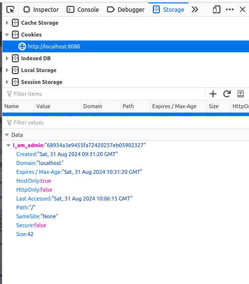

# FAIL: COOKIE

## How We Found It

We can check the browser's cookies in the Network or Application tab.

As you can see, the cookie `I_am_admin:"68934a3e9455fa72420237eb05902327"` looks very suspicious. We can guess it's an encrypted code. So, let's find out how it's encrypted and decrypt it.  
[Dcode](https://www.dcode.fr/identification-chiffrement) seems like a good solution!

We found out it's encrypted with MD5, which translates to: `false`.  
Now, we can guess that we only need to encrypt the value `true` back to `MD5` (`b326b5062b2f0e69046810717534cb09`) and replace the cookie value with the new one to get the flag!

## How to Solve It?

Avoid Storing Sensitive Information in Cookies:

	Do not store sensitive information like user roles or admin status in client-side cookies. Instead, use server-side session management to maintain user states securely.
