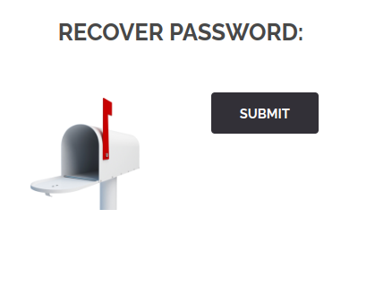

# FAIL : HIDDEN

## How we find it

In the [forgot password page](http://localhost:8080/index.php?page=recover) at first look there is nothing interesting :



But when we analyze the HTML code, we find the form and a very suspicious hidden tag:

```bash 
<form action="#" method="POST">
	<input type="hidden" name="mail" value="webmaster@borntosec.com" maxlength="15">
	<input type="submit" name="Submit" value= "Submit">
</form>
```

And when we remove the hidden type, we can see the input on the page:


So now, we try to use an email or anything, and we get the flag because there is no check on the server side.

## How to solve it?

Don't put hidden inputs in your code without validation, and always check the input on the server side.